<!--
 * @Author: zy 953725892@qq.com
 * @Date: 2023-01-12 15:29:51
 * @LastEditors: zy 953725892@qq.com
 * @LastEditTime: 2023-04-04 12:02:02
 * @FilePath: /OS/lab1实验报告.md
 * @Description: 
 * 
 * Copyright (c) 2023 by zy 953725892@qq.com, All Rights Reserved. 
-->

# lab1实验报告

## 1.实现思路
主要实现了以下几个函数完成代码行数统计功能：

- `int checkType(char* path)`: 检查一个文件类型和访问权限,通过返回值判断该文件是文件夹或普通文件或无访问权限
- `int checkSuffix(char* path,char* suffix_name)`: 检查文件是否满足suffix_name中指定后缀
- `int calSingle(char* path,int mode,char* suffix)`: 统计一个普通文件的行数
- `int calDir(char* path,int mode,int recursive,char* suffix)`: 统计一个文件夹的行数
- `void print_result(char *path, int line)`：输出最终的文件/文件夹行数统

基本思路是首先采用getotp库对命令行参数进行解析，之后对于普通文件，采用标准IO对文件内容进行读取，根据参数统计文件行数；对于文件夹，则遍历其内容，对于其中的子文件夹进行递归调用，而其中的普通文件则采用普通文件的统计方式进行计算。

## 2.测试输出结果
### 2.1 测试目录
<figure>
    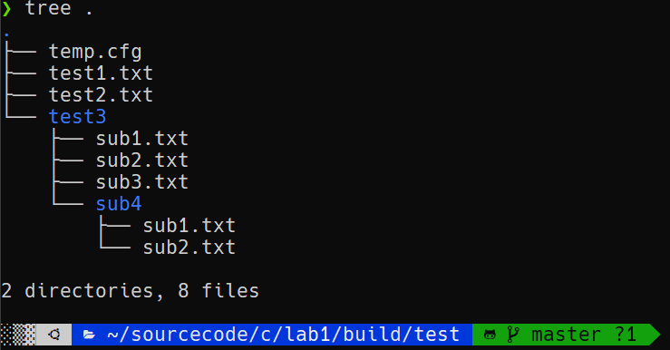
</figure>

### 2.2 命令参数
<figure>
    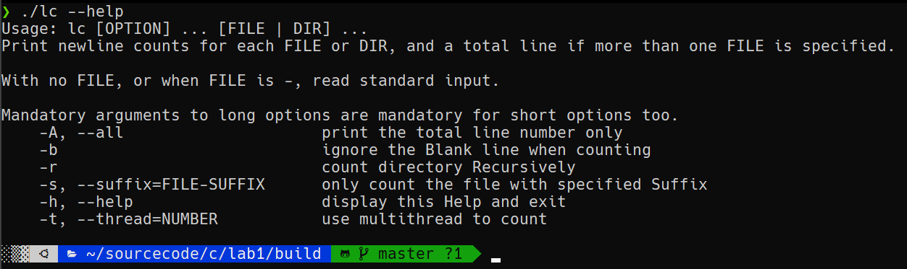
</figure>

### 2.3 单文件
<figure class="half">
    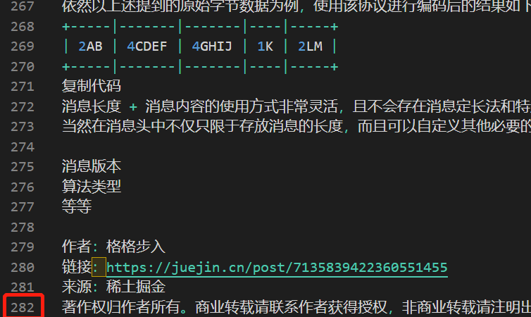
    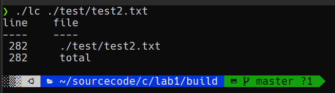
</figure>

### 2.4 多文件
<figure class="third">
    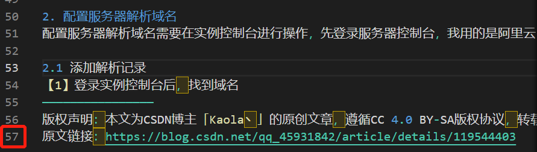
    
    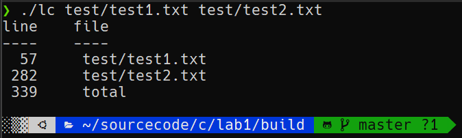
</figure>

### 2.5 文件夹
<figure>
    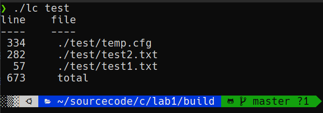
</figure>

### 2.6 --all选项
<figure>
    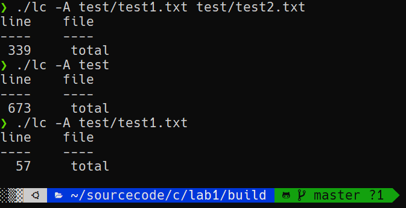
</figure>

### 2.7 -b选项 忽略空行
<figure>
    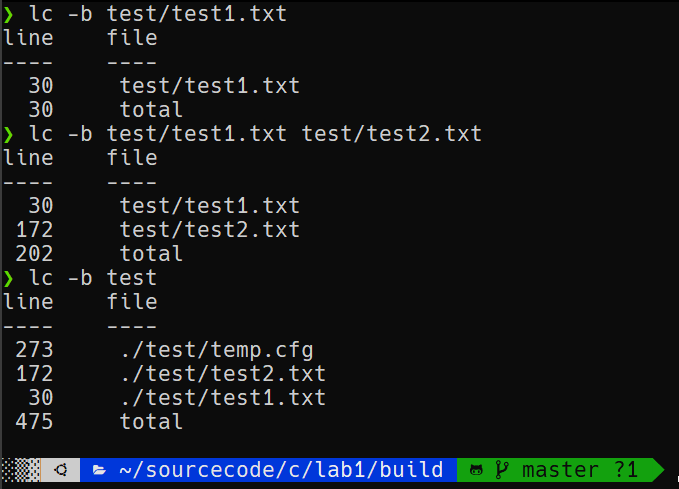
</figure>

### 2.8 --suffix选项
<figure>
    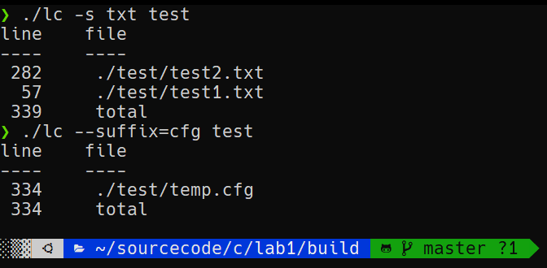
</figure>

### 2.9 -r选项
<figure>
    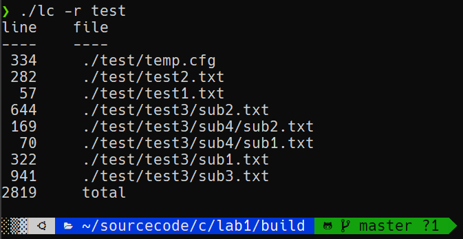
</figure>

### 2.10 混合选项
<figure>
    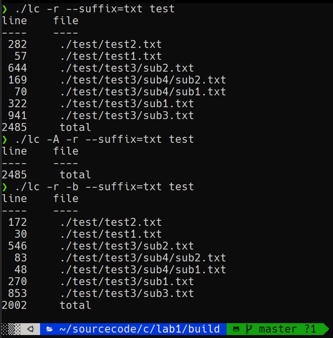
</figure>

## 3.扩展任务

### 3.1 异常处理
无访问权限的文件或文件夹，提示访问权限错误,下图中的test.txt没有读权限，因此提示权限错误
<figure>
    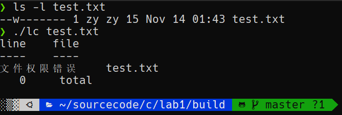
</figure>

### 3.2 与wc命令统计大文件对比
> 注：在使用wc指令时，有时其统计结果会比我们自己的lc程序少统计一行，这是因为wc对于最后一行，如果没有其换行符（而仅仅只有eof），则不将其视作是有效的一行。在本次测试时，我们使用包含430080行的txt文本文件进行测试，最终wc统计为430079行，我们的lc程序统计为430080行。
>
> 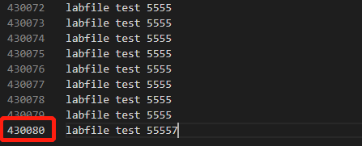
- 时间对比
可以看到，wc的时间(0.039)要略长于我们的lc程序(0.026)。
<figure>
    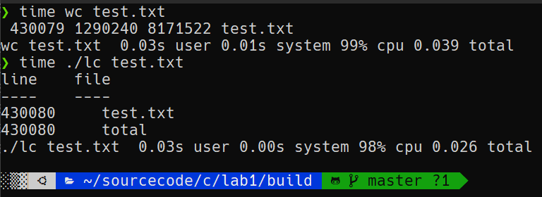
</figure>

- 系统调用
可以看到，wc的系统调用次数(600)要少于我们的lc程序的系统调用(2056)。其中最主要的差异在于read系统调用。
<figure>
    
</figure>

## C语言实现

- getopt库处理命令行参数
- fstat函数获取文件信息
- dirent库获取文件夹信息,完成文件夹的遍历
- 采用标准IO读取文件(fgets,fgetc)
- 可执行文件大小为40K

--- 

# lab2实验报告

## 1.实现思路
主要实现了以下几个函数完成对lc命令的多线程扩展：
- `void InitQueue(Queue* queue)`: 初始化任务队列
- `void QueueDestroy(Queue* queue)`: 销毁任务队列
- `void Push(Queue* queue, Task task)`: 将任务压入指定任务队列
- `Task Pop(Queue* queue)` : 弹出指定队列的队首任务
- `int QueueEmpty(Queue* queue)`: 判断任务队列是否为空
- `void assign_task(Task *task,int queue_id)`: 将任务分配给指定的任务队列
- `void consume_task(void* i)`: 执行任务队列中的任务，直到任务队列为空
- `void calDir_parallel(char* path,int mode,int recursive,char* suffix)`: 对lab1中的calDir进行并行扩展
- `void callfinish()`: 在main线程分配完任务后，向所有队列中分别插入一个结束标志

基本思路是将原本的main线程作为分配任务的master线程，-t 参数指定的线程个数为worker线程个数；对于每个worker线程，master线程会给它初始化一个任务队列，master线程不断将所有待统计的文件作为任务加入到各个worker线程对应的任务队列中，当所有任务分配完毕后，master线程会向各个worker线程对应的任务队列中分别插入一个结束标志；而worker线程则不断从自己对应的任务队列中取出任务并且执行统计工作，直到取出的任务为结束标志时，worker线程结束，并且将自己的计算结果汇总到最终结果上。注意分配任务以及结果汇总时，需要使用pthread_mutex_lock加锁，保证并发安全。

## 2.测试输出结果
### 2.1 测试目录
<figure>
    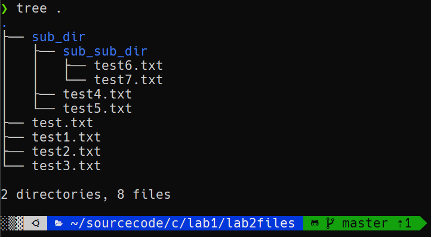
</figure>

### 2.2 命令参数
<figure>
    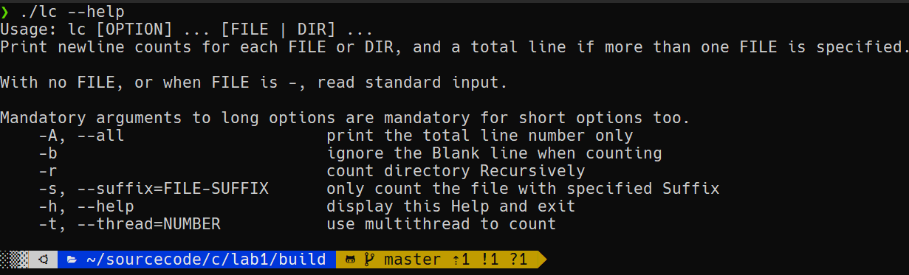
</figure>

### 2.3 单线程测试
<figure>
    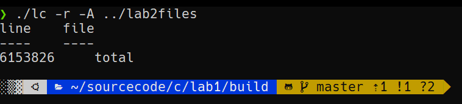
</figure>

### 2.4 多线程测试
<figure>
    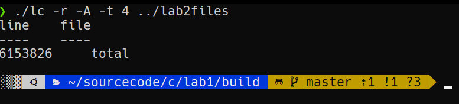
</figure>

### 2.5 对比不同线程下程序执行时间
<figure>
    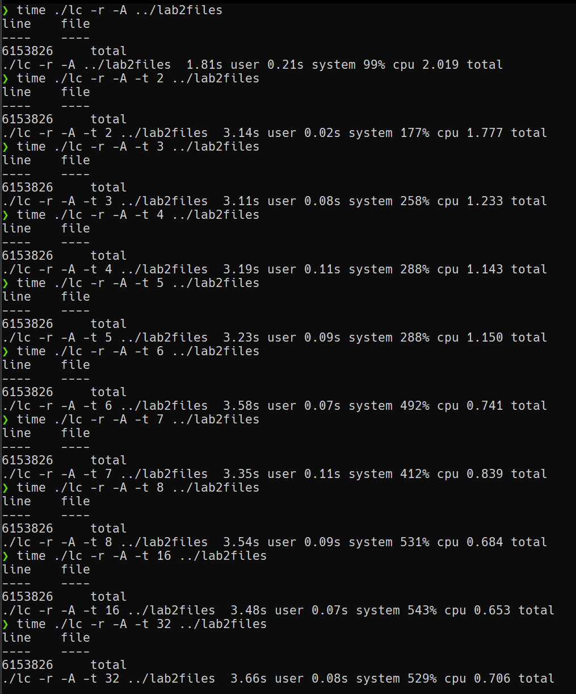
</figure>

| 线程数 | 运行时间(ms) | 加速比 |
| ------ | ------------ | ------ |
| 单线程 | 2.019        | 1.00   |
| 2      | 1.777        | 1.13   |
| 3      | 1.233        | 1.63   |
| 4      | 1.143        | 1.76   |
| 5      | 1.150        | 1.75   |
| 6      | 0.741        | 2.72   |
| 7      | 0.839        | 2.41   |
| 8      | 0.684        | 2.95   |
| 16     | 0.653        | 3.09   |
| 32     | 0.706        | 2.85   |

可以看出，当线程数为8时，多线程lc程序相比原本的单线程版本有最大加速比，其执行效率可以达到原来的3倍，而当线程数超过8时，多线程lc程序的执行效率反而会下降，这主要有两方面原因，一是这是因为当线程数过多时，系统的上下文切换开销会增大，导致效率下降；另一方面是因为测试的文件夹一共包含8个文件，而多线程版本是按照文件来给各个线程分配任务的，当线程多于8个时，后续的线程会没有任务可做，这样就会导致线程的执行效率下降。

C语言实现：
- 采用pthread库完成线程的创建、同步等操作
- 采用pthread_mutex_lock加锁，保证并发安全
- 采用master-worker的并发模式，main线程为每个worker线程分配一个任务队列，每个worker从自己的任务队列中取出任务并且执行
- 最终可执行文件大小为40K