<!--
 * @Author: zy 953725892@qq.com
 * @Date: 2023-01-12 15:29:51
 * @LastEditors: zy 953725892@qq.com
 * @LastEditTime: 2023-01-12 19:40:13
 * @FilePath: /lab1/doc/lab1实验报告.md
 * @Description: 
 * 
 * Copyright (c) 2023 by zy 953725892@qq.com, All Rights Reserved. 
-->

# lab1实验报告

## 1.实现思路
主要实现了以下几个函数完成代码行数统计功能：

- `int checkType(char* path)`: 检查一个文件类型和访问权限,通过返回值判断该文件是文件夹或普通文件或无访问权限
- `int checkSuffix(char* path,char* suffix_name)`: 检查文件是否满足suffix_name中指定后缀
- `int calSingle(char* path,int mode,char* suffix)`: 统计一个普通文件的行数
- `int calDir(char* path,int mode,int recursive,char* suffix)`: 统计一个文件夹的行数
- `void print_result(char *path, int line)`：输出最终的文件/文件夹行数统

基本思路是首先采用getotp库对命令行参数进行解析，之后对于普通文件，采用标准IO对文件内容进行读取，根据参数统计文件行数；对于文件夹，则遍历其内容，对于其中的子文件夹进行递归调用，而其中的普通文件则采用普通文件的统计方式进行计算。

## 2.测试输出结果
### 2.1 测试目录
<figure>
    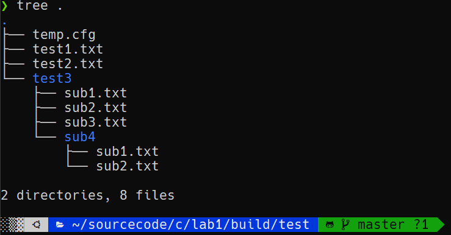
</figure>

### 2.2 命令参数
<figure>
    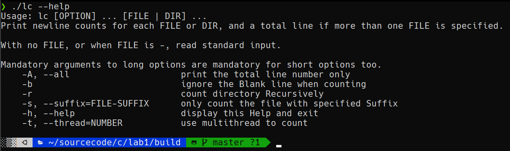
</figure>

### 2.3 单文件
<figure class="half">
    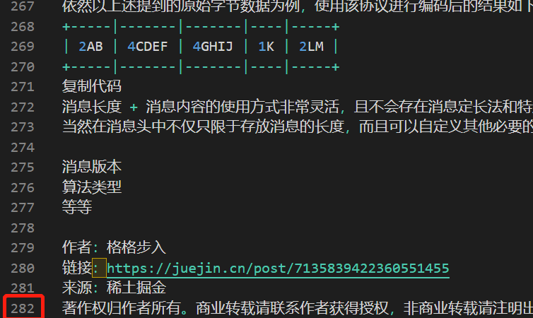
    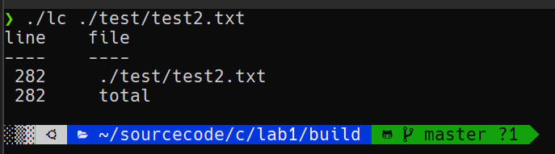
</figure>

### 2.4 多文件
<figure class="third">
    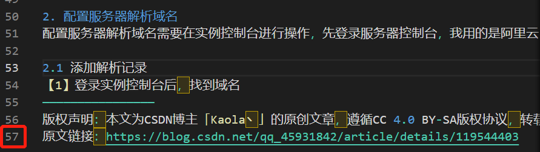
    
    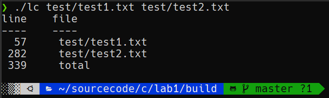
</figure>

### 2.5 文件夹
<figure>
    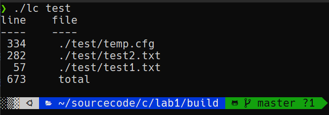
</figure>

### 2.6 --all选项
<figure>
    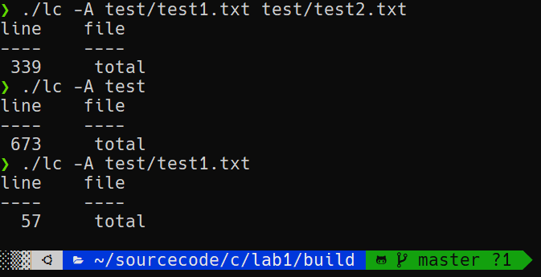
</figure>

### 2.7 -b选项 忽略空行
<figure>
    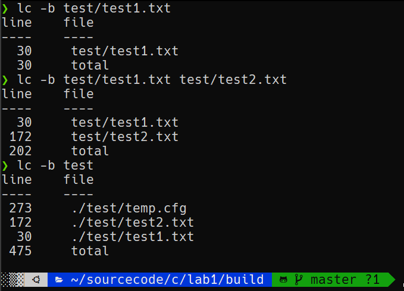
</figure>

### 2.8 --suffix选项
<figure>
    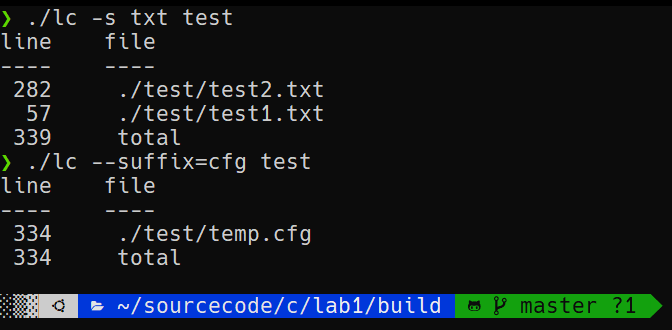
</figure>

### 2.9 -r选项
<figure>
    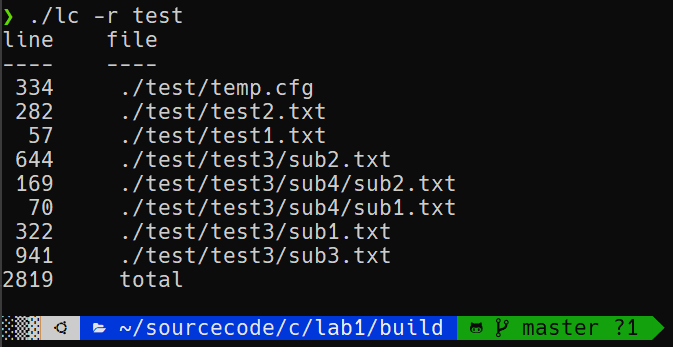
</figure>

### 2.10 混合选项
<figure>
    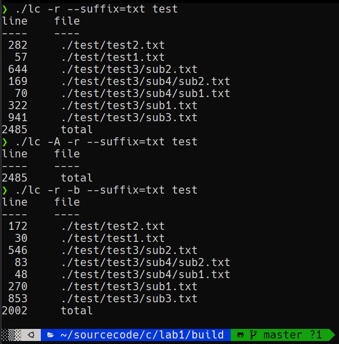
</figure>

## 3.扩展任务

### 3.1 异常处理
无访问权限的文件或文件夹，提示访问权限错误,下图中的test.txt没有读权限，因此提示权限错误
<figure>
    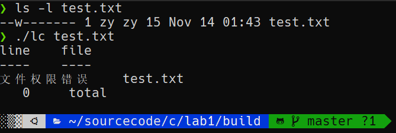
</figure>

### 3.2 与wc命令统计大文件对比
> 注：在使用wc指令时，有时其统计结果会比我们自己的lc程序少统计一行，这是因为wc对于最后一行，如果没有其换行符（而仅仅只有eof），则不将其视作是有效的一行。在本次测试时，我们使用包含430080行的txt文本文件进行测试，最终wc统计为430079行，我们的lc程序统计为430080行。
>
> 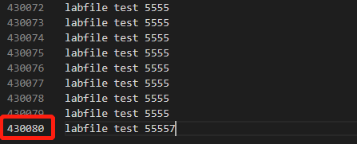
- 时间对比
可以看到，wc的时间(0.039)要略长于我们的lc程序(0.026)。
<figure>
    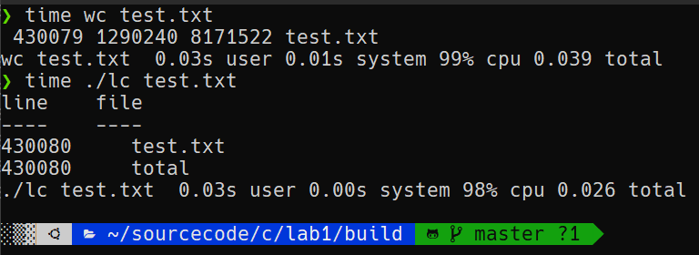
</figure>

- 系统调用
可以看到，wc的系统调用次数(600)要少于我们的lc程序的系统调用(2056)。其中最主要的差异在于read系统调用。
<figure>
    
</figure>

## C语言实现

- getopt库处理命令行参数
- fstat函数获取文件信息
- dirent库获取文件夹信息,完成文件夹的遍历
- 采用标准IO读取文件(fgets,fgetc)
- 可执行文件大小为40K